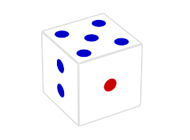

# 自适应布局与响应式布局

## 自适应布局
不同大小设备呈现同样的页面效果，只是文字、图片等的大小不一样，但是相对位置一样。
>例如：百分比布局、弹性盒布局flex、分栏布局。

### 百分比布局
所有的宽高都用百分比来实现

### CSS3分栏布局

CSS3多列布局可以自动将内容按指定的列数排列，这种特性实现的效果和报纸、杂志类排版非常相似。

#### 分栏布局属性
* columns：列宽 列数
    - column-width 栏目最小宽度
    - column-count 栏目最大列数
* column-gap   栏目间距，不能为负数
* column-rule  栏目间隔线样式，与定义边框一样
* column-span: 定义多列布局中子元素的跨列效果，通常用于标题
    * 1: 指定跨1列  
    * all: 跨所有列
 
#### 列宽度、高度的平衡
* 如果没有设置栏宽或者设置的宽度小于默认平分的宽度，那么默认平分；
* 如果设置的宽度大于默认平分的宽度，则可能减少列的数量，依旧平分。
* 小于默认生成的高度，则会造成多列出现；
* 当设置高度大于默认生成的高度，则默认生成的高度不会被改变。


### 弹性盒flex-box

#### 概述
Flexbox从本质上就是一个盒模型（Box-model）的延伸，用来实现更复杂的版面布局。它是 CSS3 的一种新的布局模式。

#### 弹性盒概念解释


**参照上图，弹性盒子按照宽和高分出了以下 8 点：**

1. 主轴（水平）: main axis
2. 纵轴（垂直，也称交叉轴）: cross axis
3. 纵轴的开始位置: cross start
4. 纵轴的结束位置: cross end
5. 主轴的开始位置: main start
6. 主轴的结束位置: main end
7. 单个子元素占据主轴的空间距离: main size
8. 单个子元素占据纵轴的空间距离: cross size

#### 使用弹性盒
设置容器为弹性盒，需加上css属性：
```css
.box{display: flex;}
```
>PS：弹性盒括中的两个对象：容器+子元素（1个或多个）

>容器设为Flex布局以后，子元素float、clear和vertical-align属性将失效。

##### 应用在容器上的属性

* flex-direction
设定主轴的方向（即子元素的排列方向）
    - row（默认）    主轴为水平方向，起点在左端。
    - row-reverse 主轴为水平方向，起点在右端。
    - column  主轴为垂直方向，起点在上沿。
    - column-reverse  主轴为垂直方向，起点在下沿。

    >改变了主轴，另一条就是交叉轴

* flex-wrap
定义如果一条轴线排不下，如何换行。
    - nowrap（默认）：不换行。
    - wrap：换行，第一行在上方。 
    - wrap-reverse：换行，第一行在下方
* flex-flow
>是flex-direction和flex-wrap属性的简写形式，默认值为row nowrap。

* justify-content
定义了子元素在主轴上的对齐方式。
    - flex-start（默认） 左对齐
    - flex-end    右对齐
    - center  居中
    - space-between   两端对齐，子元素之间的间隔都相等。
    - space-around    每个子元素两侧的间隔相等。所以，子元素之间的间隔比子元素与边框的间隔大一倍。
* align-items
定义子元素在交叉轴上的对齐方式。
    - flex-start  交叉轴的起点对齐。
    - flex-end    交叉轴的终点对齐。
    - center  交叉轴的中点对齐。
    - baseline    子元素的第一行文字的基线对齐。
    - stretch（默认）    如果子元素未设置高度或设为auto，将占满整个容器的高度。
* align-content
定义了多根轴线的对齐方式。如果子元素只有一根轴线，该属性不起作用。
    - flex-start  与交叉轴的起点对齐。
    - flex-end    与交叉轴的终点对齐。
    - center  与交叉轴的中点对齐。
    - space-between   与交叉轴两端对齐，轴线之间的间隔平均分布。
    - space-around     每根轴线两侧的间隔都相等。所以，轴线之间的间隔比轴线与边框的间隔大一倍。
    - stretch（默认值）    轴线占满整个交叉轴。

##### 应用在子元素上的属性

* order: integer
定义子元素的排列顺序，属性值为整数（默认0）。数值越小，排列越靠前。
* flex-grow: number
定义子元素在主轴上的放大比例，如果子元素没占满容器（存在剩余空间）按比例分配剩余空间。默认为0，即如果存在剩余空间，也不放大
* flex-shrink: number
定义了子元素在主轴上的缩小比例（与flex-grow相反），默认为1，即如果空间不足，该子元素将缩小
* flex-basis
定义了在分配多余空间之前，子元素占据的主轴空间（main size），可以理解为我们给子元素设置的宽度。浏览器根据这个属性，计算主轴是否有多余空间。它的默认值为auto，即子元素的本来大小
```css
.item {
  flex-basis: <length> | auto; /* default auto */
}
```
* flex
flex属性是flex-grow, flex-shrink 和 flex-basis的简写，默认值为0 1 auto。后两个属性可选。
```css
.item {
  flex: none || auto || <flex-grow> <flex-shrink> <flex-basis>
}
```
>PS：建议优先使用这个属性，而不是单独写三个分离的属性，因为浏览器会推算相关值。
该属性有两个快捷值：auto(1 1 auto) 和 none(0 0 auto)。

* align-self
允许单个子元素有与其他子元素不一样的对齐方式，可覆盖align-items属性。默认值为auto，表示继承父元素的align-items属性
>所有属性跟容器的align-items相同

【案例】

* 页面布局
* 多列布局
* 骰子点数布局


【练习】

* 立体骰子



【作业】

* 携程网手机端
* 支付宝app首页

## 响应式布局
>同一页面在不同大小设备可能呈现不一样的页面效果（伴随着网页结构的改变），自适应布局+媒体查询即可实现（响应式的概念应该覆盖了自适应，而且涵盖的内容更多）。

### 媒体查询media query

>将已有的开发技巧（弹性盒、弹性图片、媒体查询等）整合起来，命名为**“响应式布局”**，所谓响应式布局，是一种针对任意设备对网页内容进行“完美”布局的一种显示机制。
简言之，是一个网站能够兼容多个终端的布局。


#### 如何使用

1. 外联CSS语法
```html
<link rel="stylesheet" href="wide.css" media="screen and (min-width:1024px)" />
<link rel="stylesheet" href="mobile.css" media="screen and (max-width:320px)" />
```

2. 内嵌样式的语法

```html
<style>
    @media all(screen) and (min-width:500px) { … }
    @media (orientation: portrait) { … }
</style>
```


#### 媒体查询语句格式

* 一个 Media Query 包含一种媒体类型，如果媒体类型没有指定，那么就是默认类型all
```css
@media (max-width: 600px){...}
```

* 可以使用 `and` 表示同时满足这两者时生效
```css
@media handheld and (min-width:20em) and (max-width:50em){...}
```

* 逗号 `,` 被用来表示 并列 和 或者
```css
@media handheld and (max-width:20em), screen and (max-width:30em){...}
```

* 排除符合表达式的设备
```css
@media not screen and (orientation:portrait){...}
```

#### 媒体介质类型

* all       所有设备
* screen    电脑显示器
* print     打印用纸或打印预览视图
* handheld  便携设备

#### 设备特性(media feature)

* width/height: 定义输出设备中的页面可见区域宽度/高度
* device-width/device-heigh: 定义输出设备的屏幕可见宽度/高度
* orientation: 定义'height'是否大于或等于'width'。
    - portrait：是（竖屏），
    - landscape：否（横屏）

#### 优缺点

* 优势
    1. 多终端视觉和操作体验非常风格统一
    2. 兼容当前及未来新设备
    3. 响应式web设计中的大部分技术可以用在WebApp开发中
    4. 节约了开发成本，维护成本也降低很多

* 不足
    1. 兼容性：低版本浏览器兼容性有问题
    2. 移动带宽流量：相比较手机定制网站，流量稍大，
    3. 但比较加载一个完整pc端网站显然是小得多
    4. 代码累赘，会出现隐藏无用的元素，加载时间加长
    5. 兼容各种设备工作量大
